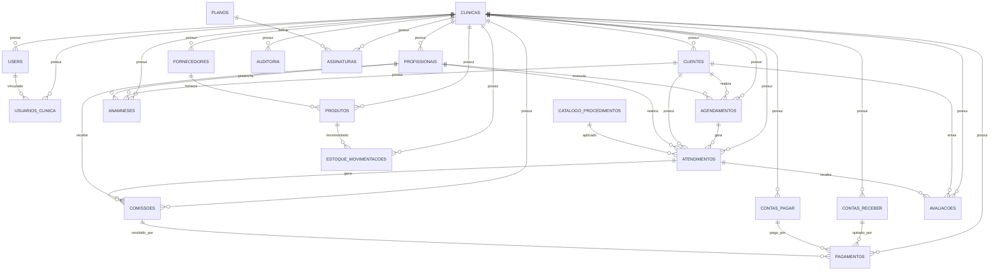

# 🎯 Implementação Completa do Diagrama ER

**Data**: 22/10/2025  
**Status**: Parcialmente Implementado (14/20 coleções = 70%)

---

## 📊 Visão Geral

### Coleções por Status

| Status | Quantidade | Percentual |
|--------|-----------|------------|
| ✅ Implementadas | 14 | 70% |
| 🆕 Novas (Prioritárias) | 3 | 15% |
| 📦 Opcionais | 3 | 15% |
| **TOTAL** | **20** | **100%** |

---

## ✅ COLEÇÕES IMPLEMENTADAS (14/20)

### 1. CLINICAS
**Status**: ✅ Implementado via `clinicaId` em todas as coleções  
**Collection**: `configuracoes` (documento por clínica)  
**Composable**: `useClinica.js`  
**Campos**:
```javascript
{
  clinicaId: string,
  nomeClinica: string,
  cnpj: string,
  endereco: string,
  telefone: string,
  whatsapp: string,
  email: string,
  nomeProprietario: string,
  registroProfissional: string,
  fotoProfissional: string,
  dataCriacao: timestamp
}
```

---

### 2. USERS
**Status**: ✅ Implementado  
**Collection**: `users`  
**Composable**: `useAuth.js`  
**Campos**:
```javascript
{
  id: string,
  uid: string,              // Firebase Auth UID
  nome: string,
  email: string,
  role: string,             // 'admin', 'profissional'
  clinicaId: string,
  dataCriacao: timestamp
}
```

---

### 3. CLIENTES
**Status**: ✅ Implementado  
**Collection**: `clientes`  
**Composable**: `usePacientes.js`  
**Campos**:
```javascript
{
  id: string,
  nome: string,
  dataNascimento: string,
  telefone: string,
  cpf: string,
  email: string,
  endereco: string,
  fotoURL: string,
  ativo: boolean,
  totalAnamneses: number,
  clinicaId: string,
  dataCriacao: timestamp,
  dataAtualizacao: timestamp
}
```

---

### 4. PROFISSIONAIS
**Status**: ✅ Implementado  
**Collection**: `profissionais`  
**Composable**: `useProfissionais.js`  
**Campos**:
```javascript
{
  id: string,
  nome: string,
  especialidade: string,
  registroProfissional: string,
  telefone: string,
  email: string,
  percentualComissao: number,
  tipoComissao: string,
  observacoes: string,
  ativo: boolean,
  clinicaId: string,
  dataCriacao: timestamp
}
```

---

### 5. ANAMNESES
**Status**: ✅ Implementado  
**Collection**: `anamneses`  
**Composable**: `usePacientes.js`  
**Campos**:
```javascript
{
  id: string,
  clienteId: string,         // FK para clientes
  profissionalId: string,    // FK para profissionais (quem preencheu)
  nome: string,
  telefone: string,
  dataNascimento: string,
  cpf: string,
  email: string,
  // ... campos médicos e estéticos
  fotoURL: string,
  status: string,            // 'pendente', 'analisada'
  origem: string,            // 'cliente', 'profissional'
  clinicaId: string,
  dataCriacao: timestamp
}
```

---

### 6. AGENDAMENTOS
**Status**: ✅ Implementado + Campo `origem` adicionado  
**Collection**: `agendamentos`  
**Composable**: `useAgendamento.js`  
**Campos**:
```javascript
{
  id: string,
  clienteId: string,         // FK para clientes
  clienteNome: string,
  pacienteFoto: string,
  profissionalId: string,    // FK para profissionais
  profissionalNome: string,
  procedimentoId: string,    // FK para catalogo_procedimentos
  procedimento: string,
  dataHora: timestamp,
  duracao: number,
  valorEstimado: number,
  status: string,            // 'confirmado', 'realizado', 'cancelado', 'pendente'
  origem: string,            // ✅ NOVO: 'online', 'presencial', 'telefone', 'whatsapp'
  observacoes: string,
  clinicaId: string,
  dataCriacao: timestamp
}
```

---

### 7. ATENDIMENTOS
**Status**: ✅ Implementado  
**Collection**: `atendimentos`  
**Composable**: `useProcedimentos.js` (função `registrarAtendimento`)  
**Campos Atuais**:
```javascript
{
  id: string,
  clienteId: string,
  clienteNome: string,
  profissionalId: string,
  profissionalNome: string,
  procedimentos: array,      // Lista de procedimentos realizados
  produtosUtilizados: array,
  valorTotal: number,
  formaPagamento: string,
  observacoes: string,
  clinicaId: string,
  dataAtendimento: timestamp
}
```

**Campos a Adicionar** (Conforme Diagrama):
```javascript
{
  agendamentoId: string,     // 🆕 FK para agendamentos
  pagamentoStatus: string,   // 🆕 'pendente', 'pago', 'parcial'
  contaReceberId: string     // 🆕 FK para contas_receber
}
```

---

### 8. CATALOGO_PROCEDIMENTOS
**Status**: ✅ Implementado  
**Collection**: `catalogo_procedimentos`  
**Composable**: `useProcedimentos.js`  
**Campos**:
```javascript
{
  id: string,
  nome: string,
  categoria: string,
  valor: number,             // Chamado 'preco' no diagrama
  duracao: number,
  sessoesRecomendadas: number,
  descricao: string,
  observacoes: string,
  produtosUtilizados: array,
  ativo: boolean,
  totalRealizados: number,
  clinicaId: string,
  dataCriacao: timestamp,
  dataAtualizacao: timestamp
}
```

---

### 9. PRODUTOS
**Status**: ✅ Implementado  
**Collection**: `produtos`  
**Composable**: `useProdutos.js`  
**Campos**:
```javascript
{
  id: string,
  nome: string,
  fornecedorId: string,      // FK para fornecedores
  categoria: string,
  marca: string,
  estoqueAtual: number,
  estoqueMinimo: number,
  estoqueMaximo: number,
  precoCusto: number,
  precoVenda: number,
  unidade: string,
  dataValidade: string,
  statusValidade: string,
  observacoes: string,
  ativo: boolean,
  clinicaId: string,
  dataCriacao: timestamp
}
```

---

### 10. FORNECEDORES
**Status**: ✅ Implementado  
**Collection**: `fornecedores`  
**Composable**: `useFornecedores.js`  
**Campos**:
```javascript
{
  id: string,
  nome: string,
  cnpj: string,
  telefone: string,
  email: string,
  endereco: string,
  observacoes: string,
  ativo: boolean,
  clinicaId: string,
  dataCriacao: timestamp
}
```

---

### 11. ESTOQUE_MOVIMENTACOES
**Status**: ✅ Implementado  
**Collection**: `estoque_movimentacoes`  
**Composable**: `useEstoque.js`  
**Campos**:
```javascript
{
  id: string,
  produtoId: string,         // FK para produtos
  produtoNome: string,
  tipo: string,              // 'entrada', 'saida'
  quantidade: number,
  motivo: string,
  data: timestamp,
  clinicaId: string
}
```

---

### 12. CONTAS_RECEBER
**Status**: ✅ Implementado  
**Collection**: `contas_receber`  
**Composable**: `useFinanceiro.js`  
**Campos**:
```javascript
{
  id: string,
  clienteId: string,         // FK para clientes
  clienteNome: string,
  descricao: string,
  valor: number,
  categoria: string,
  vencimento: timestamp,
  status: string,            // 'pendente', 'pago', 'vencido'
  dataPagamento: timestamp,
  formaPagamento: string,
  observacoes: string,
  clinicaId: string,
  dataCriacao: timestamp
}
```

---

### 13. CONTAS_PAGAR
**Status**: ✅ Implementado  
**Collection**: `contas_pagar`  
**Composable**: `useFinanceiro.js`  
**Campos**:
```javascript
{
  id: string,
  fornecedorId: string,      // FK para fornecedores
  fornecedorNome: string,
  descricao: string,
  valor: number,
  categoria: string,
  vencimento: timestamp,
  status: string,            // 'pendente', 'pago', 'vencido'
  dataPagamento: timestamp,
  formaPagamento: string,
  observacoes: string,
  clinicaId: string,
  dataCriacao: timestamp
}
```

---

### 14. COMISSOES
**Status**: ✅ Implementado  
**Collection**: `comissoes`  
**Composable**: `useComissoes.js`  
**Campos**:
```javascript
{
  id: string,
  profissionalId: string,    // FK para profissionais
  profissionalNome: string,
  atendimentoId: string,     // FK para atendimentos
  valor: number,
  percentual: number,
  status: string,            // 'pendente', 'pago' (campo 'pago' do diagrama)
  dataPagamento: timestamp,
  formaPagamento: string,
  clinicaId: string,
  dataCriacao: timestamp
}
```

---

## 🆕 COLEÇÕES NOVAS (Prioritárias - 3)

### 1. PAGAMENTOS ⚡ ALTA PRIORIDADE
**Status**: 🆕 Composable criado (`usePagamentos.js`)  
**Collection**: `pagamentos`  
**Descrição**: Registro detalhado de todas as transações financeiras  

**Campos**:
```javascript
{
  id: string,
  contaId: string,           // FK para contas_pagar/contas_receber/comissoes
  tipo: string,              // 'pagamento', 'recebimento', 'pagamento_comissao'
  valor: number,
  formaPagamento: string,    // 'dinheiro', 'pix', 'cartao_credito', 'cartao_debito', 'transferencia'
  dataPagamento: timestamp,
  usuarioId: string,         // Quem registrou o pagamento
  observacoes: string,
  clinicaId: string,
  dataCriacao: timestamp
}
```

**Funções Implementadas**:
- ✅ `registrarPagamento()` - Para contas_pagar
- ✅ `registrarRecebimento()` - Para contas_receber
- ✅ `pagarComissao()` - Para comissoes
- ✅ `buscarPagamentos()` - Com filtros
- ✅ `buscarPagamentosConta()` - Por conta específica
- ✅ `calcularEstatisticas()` - Analytics

**Integração Necessária**:
- [ ] Atualizar `ContasPagar.vue` para usar `registrarPagamento()`
- [ ] Atualizar `ContasReceber.vue` para usar `registrarRecebimento()`
- [ ] Atualizar `Comissoes.vue` para usar `pagarComissao()`
- [ ] Criar view `Pagamentos.vue` para histórico completo

---

### 2. USUARIOS_CLINICA ⚡ ALTA PRIORIDADE
**Status**: 🆕 NÃO IMPLEMENTADO  
**Collection**: `usuarios_clinica`  
**Descrição**: Vincular múltiplos usuários a uma clínica

**Campos**:
```javascript
{
  id: string,
  userId: string,            // FK para users
  clinicaId: string,         // FK para clinicas
  role: string,              // 'admin', 'profissional', 'recepcionista', 'financeiro'
  permissoes: array,         // Lista de permissões específicas
  ativo: boolean,
  convidadoPor: string,      // userId de quem convidou
  dataConvite: timestamp,
  dataAceite: timestamp,
  dataCriacao: timestamp,
  dataAtualizacao: timestamp
}
```

**Composable**: `useUsuariosClinica.js`

**Funções Necessárias**:
- [ ] `buscarUsuariosDaClinica()` - Lista todos usuários
- [ ] `convidarUsuario()` - Enviar convite
- [ ] `aceitarConvite()` - Aceitar convite
- [ ] `removerUsuario()` - Remover acesso
- [ ] `atualizarRole()` - Alterar permissões
- [ ] `verificarPermissao()` - Checar se usuário pode fazer ação

**View**: `EquipeClinica.vue`

---

### 3. AUDITORIA 🔒 MÉDIA PRIORIDADE
**Status**: 🆕 NÃO IMPLEMENTADO  
**Collection**: `auditoria`  
**Descrição**: Log de todas as ações no sistema

**Campos**:
```javascript
{
  id: string,
  entidade: string,          // 'clientes', 'atendimentos', 'produtos', etc
  documentoId: string,       // ID do documento modificado
  acao: string,              // 'create', 'update', 'delete'
  usuarioId: string,         // Quem fez a ação
  usuarioNome: string,
  dadosAntigos: object,      // Snapshot do documento antes
  dadosNovos: object,        // Snapshot do documento depois
  ip: string,                // IP do usuário (opcional)
  data: timestamp,
  clinicaId: string
}
```

**Composable**: `useAuditoria.js`

**Funções Necessárias**:
- [ ] `registrarAcao()` - Registrar ação automaticamente
- [ ] `buscarAuditoria()` - Com filtros
- [ ] `buscarAuditoriaDocumento()` - Histórico de um documento
- [ ] `buscarAuditoriaUsuario()` - Ações de um usuário

**Middleware**: Criar função interceptadora global

**View**: `Auditoria.vue` - Log de ações

**Configuração**:
- TTL automático: Manter apenas últimos 90 dias
- Export periódico para arquivo

---

## 🌟 COLEÇÕES NOVAS (Importantes - 2)

### 4. AVALIACOES
**Status**: 🆕 NÃO IMPLEMENTADO  
**Collection**: `avaliacoes`  
**Descrição**: Avaliações dos clientes sobre atendimentos

**Campos**:
```javascript
{
  id: string,
  clienteId: string,         // FK para clientes
  clienteNome: string,
  atendimentoId: string,     // FK para atendimentos
  nota: number,              // 1-5 estrelas
  comentario: string,
  aspectos: object,          // {atendimento: 5, ambiente: 4, resultado: 5}
  recomendaria: boolean,
  data: timestamp,
  clinicaId: string,
  respondido: boolean,
  respostaClinica: string,
  dataResposta: timestamp,
  usuarioResposta: string
}
```

**Composable**: `useAvaliacoes.js`

**Funções Necessárias**:
- [ ] `criarAvaliacao()` - Cliente cria avaliação
- [ ] `buscarAvaliacoes()` - Lista avaliações
- [ ] `responderAvaliacao()` - Clínica responde
- [ ] `calcularNPS()` - Net Promoter Score
- [ ] `calcularMediaNotas()` - Média geral
- [ ] `estatisticasAvaliacoes()` - Dashboard

**Views**:
- [ ] `AvaliacaoCliente.vue` - Cliente preenche (link público)
- [ ] `Avaliacoes.vue` - Clínica gerencia avaliações
- [ ] Widget no Dashboard com NPS

**Features**:
- Link único por atendimento para avaliação
- Notificação automática por email/SMS (futuro)
- Badge de "Verificado" para avaliações

---

## 📦 COLEÇÕES OPCIONAIS (Futuro - 3)

### 5. PLANOS
**Status**: 📦 Removido anteriormente, pode ser reativado  
**Collection**: `planos`  
**Descrição**: Planos de assinatura disponíveis

**Campos**:
```javascript
{
  id: string,
  nome: string,              // 'Básico', 'Profissional', 'Premium', 'Enterprise'
  descricao: string,
  limiteUsuarios: number,
  limitePacientes: number,
  limiteAgendamentos: number,
  limiteArmazenamento: number, // GB
  valorMensal: number,
  valorAnual: number,
  recursos: array,           // ['agendamento_online', 'whatsapp', 'relatorios_avancados']
  ativo: boolean,
  ordem: number,             // Ordem de exibição
  dataCriacao: timestamp
}
```

**Composable**: `usePlanos.js`

**View**: `Planos.vue` - Escolha de plano

---

### 6. ASSINATURAS
**Status**: 📦 NÃO IMPLEMENTADO  
**Collection**: `assinaturas`  
**Descrição**: Assinaturas ativas das clínicas

**Campos**:
```javascript
{
  id: string,
  clinicaId: string,         // FK para clinicas
  planoId: string,           // FK para planos
  planoNome: string,
  status: string,            // 'ativa', 'cancelada', 'suspensa', 'trial', 'inadimplente'
  dataInicio: timestamp,
  dataExpiracao: timestamp,
  formaPagamento: string,
  valorMensal: number,
  proximaCobranca: timestamp,
  diasRestantesGratis: number, // Para trial
  pagamentoAutomatico: boolean,
  dataCriacao: timestamp,
  dataAtualizacao: timestamp,
  dataCancelamento: timestamp
}
```

**Composable**: `useAssinaturas.js`

**Funções Necessárias**:
- [ ] `obterAssinaturaAtiva()` - Assinatura da clínica atual
- [ ] `criarAssinatura()` - Nova assinatura
- [ ] `atualizarAssinatura()` - Mudar plano
- [ ] `cancelarAssinatura()` - Cancelar
- [ ] `verificarLimites()` - Checar se está dentro dos limites
- [ ] `bloquearRecursos()` - Bloquear se inadimplente

**View**: `MinhaAssinatura.vue` - Status e gestão

---

## 🔄 CAMPOS A ADICIONAR

### AGENDAMENTOS
```javascript
origem: 'presencial' // ✅ JÁ ADICIONADO
```

### ATENDIMENTOS
```javascript
agendamentoId: string,      // 🔄 A ADICIONAR
pagamentoStatus: string,    // 🔄 A ADICIONAR
contaReceberId: string      // 🔄 A ADICIONAR
```

### COMISSOES
```javascript
pagamentoId: string         // 🔄 A ADICIONAR (quando implementar PAGAMENTOS)
```

---

## 🎯 Roadmap de Implementação

### Sprint 1 (Imediato) - PAGAMENTOS ⚡
- [x] Criar `usePagamentos.js`
- [x] Adicionar campo `origem` em agendamentos
- [ ] Adicionar campos em atendimentos (`agendamentoId`, `pagamentoStatus`, `contaReceberId`)
- [ ] Atualizar `useFinanceiro.js` para integrar com pagamentos
- [ ] Atualizar views financeiras (ContasPagar, ContasReceber, Comissoes)
- [ ] Criar view `Pagamentos.vue` (histórico)
- [ ] Testar fluxo completo de pagamento

**Tempo estimado**: 2-3 horas  
**Impacto**: Alto - Melhora rastreabilidade financeira

---

### Sprint 2 (Curto Prazo) - USUÁRIOS MÚLTIPLOS 👥
- [ ] Criar `useUsuariosClinica.js`
- [ ] Criar sistema de convites
- [ ] Implementar roles e permissões
- [ ] Criar view `EquipeClinica.vue`
- [ ] Atualizar guards de rota para checar permissões
- [ ] Atualizar Firestore rules

**Tempo estimado**: 4-5 horas  
**Impacto**: Alto - Permite trabalho em equipe

---

### Sprint 3 (Médio Prazo) - AUDITORIA 🔒
- [ ] Criar `useAuditoria.js`
- [ ] Criar middleware de log automático
- [ ] Integrar em todos os composables
- [ ] Criar view `Auditoria.vue`
- [ ] Implementar TTL (90 dias)
- [ ] Configurar exportação automática

**Tempo estimado**: 3-4 horas  
**Impacto**: Médio - Segurança e compliance

---

### Sprint 4 (Médio Prazo) - AVALIAÇÕES ⭐
- [ ] Criar `useAvaliacoes.js`
- [ ] Criar view `AvaliacaoCliente.vue` (pública)
- [ ] Criar view `Avaliacoes.vue` (gerenciamento)
- [ ] Gerar link único por atendimento
- [ ] Implementar NPS no dashboard
- [ ] Sistema de resposta da clínica

**Tempo estimado**: 3-4 horas  
**Impacto**: Alto - Feedback e qualidade

---

### Sprint 5 (Futuro) - PLANOS E ASSINATURAS 💰
- [ ] Reativar sistema de planos
- [ ] Criar `usePlanos.js` e `useAssinaturas.js`
- [ ] Integração com gateway de pagamento
- [ ] Controle de limites por plano
- [ ] Views de gestão
- [ ] Sistema de cobrança automática

**Tempo estimado**: 8-10 horas  
**Impacto**: Alto - Monetização

---

## 📐 Diagrama ER Atualizado (Após Implementação)



---

## 🎯 Resumo Executivo

### O Que Foi Feito ✅
- ✅ 14 coleções principais implementadas (70%)
- ✅ Análise completa do diagrama ER
- ✅ Composable `usePagamentos.js` criado
- ✅ Campo `origem` adicionado em agendamentos
- ✅ Documento de análise criado

### O Que Falta Fazer 🔄
- 🔄 3 coleções prioritárias (USUARIOS_CLINICA, AUDITORIA)
- 🔄 1 coleção importante (AVALIACOES)
- 🔄 3 coleções opcionais (PLANOS, ASSINATURAS)
- 🔄 Integração de pagamentos nas views
- 🔄 Campos adicionais em atendimentos

### Prioridade de Implementação
1. ⚡ **PAGAMENTOS** - Integrar nas views (2h)
2. ⚡ **USUARIOS_CLINICA** - Sistema multi-usuário (4h)
3. 🔒 **AUDITORIA** - Log de ações (3h)
4. ⭐ **AVALIACOES** - Feedback de clientes (3h)
5. 📦 **PLANOS/ASSINATURAS** - Monetização (8h+)

**Total de trabalho restante**: ~20 horas de desenvolvimento

---

*Documento criado: 22/10/2025*  
*Última atualização: 22/10/2025*

